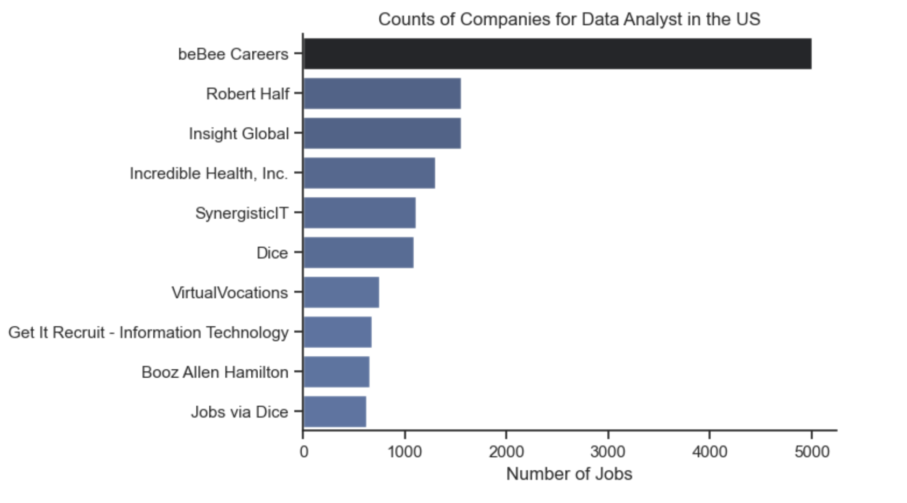
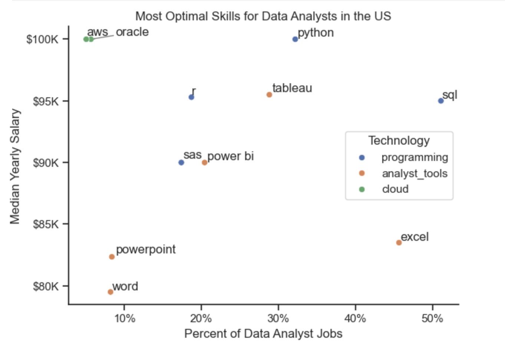

# Data Analyst Job Market Analysis: Skills Demand and Salary Insights

## Overview

This project presents a data-driven analysis of the data job market with a specific focus on Data Analyst roles. The objective is to better understand market demand, salary trends, and the skills that offer the highest return for professionals pursuing or advancing careers in data analytics.

The analysis is based on a structured dataset sourced from Practical Data Science with Python (RMIT), which includes detailed information on job titles, salaries, locations, and required technical skills. Using Python, this project explores market patterns to identify high-value skill sets and support career-focused decision-making.

## Key Questions Addressed

This project aims to answer the following questions:

* What skills are most in demand across the top three data-related roles?

* How are in-demand skills trending for Data Analysts?

* How do salaries vary across roles and skill sets within data analytics?

* Which skills offer the optimal balance of high demand and high compensation for Data Analysts?

## Tools and Technologies

The analysis was conducted using the following tools and technologies:

* Python – Core language used for data processing, analysis, and insights generation

* Pandas – Data manipulation and analysis

* Matplotlib – Data visualization

* Seaborn – Advanced and enhanced visualizations

* Jupyter Notebook – Used for data exploration, analysis, visualization, and documentation in a single reproducible environment

## Data Preparation and Cleaning

This stage focuses on preparing the raw dataset for analysis by ensuring data accuracy, consistency, and usability. Key steps include:

* Handling missing or incomplete values

* Standardizing job titles and skill names

* Validating relationships between roles, skills, and salary data

These steps ensure the dataset is reliable and suitable for meaningful analysis.

## Import and Data Preparation

The analysis begins by importing the required libraries, loading the dataset, and performing initial data cleaning. This includes date formatting, parsing skill lists, and filtering the dataset to focus exclusively on job postings based in the United States.

```
# Importing Libraries
import ast
import pandas as pd
import seaborn as sns
from datasets import load_dataset
import matplotlib.pyplot as plt

# Loading Data
df = pd.read_csv("data/job_postings_flat.csv")

# Data Cleanup
df['job_posted_date'] = pd.to_datetime(df['job_posted_date'])
df['job_skills'] = df['job_skills'].apply(lambda x: ast.literal_eval(x) if pd.notna(x) else x)
```

## Filter U.S. Job Postings

Due to the United States representing the largest market for data roles, the dataset is filtered to include only job postings located in the U.S.
```
df_DA_US = df[(df['job_country'] == 'United States') & (df['job_title_short'] == 'Data Analyst')]
```
## Analysis
Each Jupyter notebook in this project investigates a specific aspect of the data job market. The sections below outline the analytical approach used to address each research question.

## Notebook 1 — U.S. Data Analyst Job Market Overview

This notebook provides a foundational overview of the U.S. data analyst job market, focusing on job availability, employer characteristics, and commonly offered benefits. Due to the United States representing the largest market for data roles, the analysis is restricted to U.S.-based job postings to ensure relevance and consistency.

### Key Analyses Performed

* Filtered and prepared U.S.-based Data Analyst job postings

* Analyzed job benefits and requirements, including:

  * Work-from-home availability

  * Degree requirements

  * Health insurance offerings

* Identified companies with the highest volume of Data Analyst job postings

### Plot
```
# rewrite the above with a for loop
dict_column = {
    'job_work_from_home': 'Work from Home Offered',
    'job_no_degree_mention': 'Degree Requirement',
    'job_health_insurance': 'Health Insurance Offered'
}

fig, ax = plt.subplots(1, 3)
fig.set_size_inches((12, 5))

for i, (column, title) in enumerate(dict_column.items()):
    ax[i].pie(df_DA_US[column].value_counts(), labels=['False', 'True'], autopct='%1.1f%%', startangle=90)
    ax[i].set_title(title)

# plt.suptitle('Benefit Analysis of Data Jobs', fontsize=16)
plt.show()
```


```
df_plot = df_DA_US['company_name'].value_counts().head(10).to_frame()

sns.set_theme(style='ticks')
sns.barplot(data=df_plot, x='count', y='company_name', hue='count', palette='dark:b_r', legend=False)
sns.despine()
plt.title('Counts of Companies for Data Analyst in the US')
plt.xlabel('Number of Jobs')
plt.ylabel('')
plt.show()
```




### Key Findings

* Remote Work Availability: Fully remote roles remain limited, with a large majority of postings not explicitly offering work-from-home options.

* Degree Requirements: Most Data Analyst job postings still indicate a degree requirement, though a notable portion do not, suggesting increasing flexibility in hiring criteria.

* Benefits Coverage: Health insurance is not consistently listed across postings, indicating variation in benefit transparency or offerings.

* Employer Concentration: A small number of companies and recruiting platforms account for a disproportionately large share of job postings, highlighting the role of large recruiters and aggregators in the data job market.

### Purpose of This Notebook

This notebook establishes a high-level understanding of the current U.S. Data Analyst job landscape. The insights derived here serve as a baseline for deeper analyses in subsequent notebooks, including skill demand trends, salary distributions, and optimal skill combinations.


## Notebook 2 — Skill Demand Across Major Data Roles (U.S.)

This notebook analyzes the likelihood of specific technical skills being requested across major data roles in the U.S. job market. To ensure fair comparison across roles with different job volumes, raw skill counts are normalized into percentages, representing how often a skill appears within each job title.

### Key Analyses Performed

* Calculated total job counts per data role

* Merged skill counts with total job counts

* Converted raw skill frequencies into percentage-based metrics

* Visualized the top five most requested skills for:

  * Data Analysts

  * Data Engineers

  * Data Scientists

### Convert Counts to Percentages Methods
```
# Use original df to get the count of job titles
df_job_title_count = df_US['job_title_short'].value_counts().reset_index(name='jobs_total')

df_job_title_count


df_skills_perc = pd.merge(df_skills_count, df_job_title_count, on='job_title_short', how='left')

df_skills_perc['skill_percent'] = (df_skills_perc['skill_count'] / df_skills_perc['jobs_total']) * 100

df_skills_perc
```

### Plot
```
fig, ax = plt.subplots(len(job_titles), 1)


for i, job_title in enumerate(job_titles):
    df_plot = df_skills_perc[df_skills_perc['job_title_short'] == job_title].head(5)
    sns.barplot(data=df_plot, x='skill_percent', y='job_skills', ax=ax[i], hue='skill_count', palette='dark:b_r')
    ax[i].set_title(job_title)
    ax[i].set_ylabel('')
    ax[i].set_xlabel('')
    ax[i].get_legend().remove()
    ax[i].set_xlim(0, 78)
    # remove the x-axis tick labels for better readability
    if i != len(job_titles) - 1:
        ax[i].set_xticks([])

    # label the percentage on the bars
    for n, v in enumerate(df_plot['skill_percent']):
        ax[i].text(v + 1, n, f'{v:.0f}%', va='center')

fig.suptitle('Likelihood of Skills Requested in US Job Postings', fontsize=15)
fig.tight_layout(h_pad=.8)
plt.show()
```


### Key Findings

* Data Analyst Roles

  * SQL (45%) and Excel (36%) are the most frequently requested skills.

  * Python (25%) appears less consistently than in engineering or science roles.

  * Visualization tools such as Tableau and Power BI remain relevant but secondary.

* Data Engineer Roles

  * Strong emphasis on SQL (64%) and Python (62%).

  * Cloud technologies such as AWS (40%) and Azure (33%) are commonly required.

  * Apache Spark (30%) reflects the importance of large-scale data processing.

* Data Scientist Roles

  * Python (66%) dominates skill requirements.

  * SQL (47%) remains essential, reinforcing the need for strong data querying skills.

  * Statistical and analytical tools such as R (39%) and SAS (21%) appear more frequently than in     other roles.

### Purpose of This Notebook

This notebook highlights how skill demand differs significantly by role, reinforcing that a one-size-fits-all skill stack is ineffective in data careers. By expressing skill demand as percentages rather than raw counts, the analysis provides a clearer picture of which skills are core requirements versus role-specific differentiators.

## Notebook 3 — Monthly Trends in Skill Demand for Data Analysts (U.S.)

This notebook examines how demand for core Data Analyst skills changes over time, focusing on monthly trends across the U.S. job market in 2023. To enable meaningful comparison, skill counts are normalized by total monthly job postings and expressed as percentages, representing the likelihood of each skill appearing in a job posting.

### Key Analyses Performed

* Aggregated monthly Data Analyst job postings

* Normalized skill counts into percentage-based metrics

* Transformed month indices into readable month labels

* Visualized monthly trends for the top five most requested skills

* Annotated end-of-year values for interpretability

```
from matplotlib.ticker import PercentFormatter

df_plot = df_DA_US_percent.iloc[:, :5]
sns.lineplot(data=df_plot, dashes=False, legend='full', palette='tab10')
sns.set_theme(style='ticks')
sns.despine() # remove top and right spines

plt.title('Trending Top Skills for Data Analysts in the US')
plt.ylabel('Likelihood in Job Posting')
plt.xlabel('2023')
plt.legend().remove()
plt.gca().yaxis.set_major_formatter(PercentFormatter(decimals=0))

# annotate the plot with the top 5 skills using plt.text()
for i in range(5):
    plt.text(11.2, df_plot.iloc[-1, i], df_plot.columns[i], color='black')

plt.show()
```


### Key Findings

* SQL remains the most consistently demanded skill throughout the year, peaking mid-year before gradually declining toward Q4.

* Excel shows moderate volatility, with noticeable increases in early and late parts of the year, indicating continued relevance in traditional analytics roles.

* Python demonstrates steady demand with a mid-year peak, reinforcing its role as a complementary (rather than primary) skill for Data Analysts.

* Tableau remains relatively stable but shows a slight downward trend in the second half of the year.

* Power BI consistently ranks lowest among the top five skills, with modest fluctuations and limited seasonal growth.

### Interpretation

The results indicate that core analytical tools (SQL and Excel) remain foundational across the year, while programming and visualization tools exhibit more variability. This suggests that Data Analyst roles prioritize data querying and manipulation skills consistently, while demand for advanced tools may be influenced by hiring cycles, project needs, or organizational maturity.

### Purpose of This Notebook

This notebook adds a temporal dimension to the skill demand analysis, demonstrating that while certain skills dominate year-round, others fluctuate seasonally. These insights support strategic skill development by highlighting which competencies are stable requirements versus time-sensitive advantages.

## Notebook 4 — Skill Payoff vs Market Demand for Data Analysts (U.S.)

This notebook analyzes the relationship between skill demand and compensation for Data Analyst roles in the U.S. job market. By comparing the highest-paid skills against the most in-demand skills, the analysis highlights gaps between what employers frequently request and what commands premium salaries.

### Key Analyses Performed

* Calculated median salaries associated with individual skills for Data Analyst roles

* Identified the top-paying skills based on median salary

* Identified the most frequently requested skills based on job posting counts

* Visualized both dimensions side-by-side to contrast pay vs demand

```
fig, ax = plt.subplots(2, 1)  

# Top 10 Highest Paid Skills for Data Analysts
sns.barplot(data=df_DA_top_pay, x='median', y=df_DA_top_pay.index, hue='median', ax=ax[0], palette='dark:b_r')
ax[0].legend().remove()
# original code:
# df_DA_top_pay[::-1].plot(kind='barh', y='median', ax=ax[0], legend=False) 
ax[0].set_title('Highest Paid Skills for Data Analysts in the US')
ax[0].set_ylabel('')
ax[0].set_xlabel('')
ax[0].xaxis.set_major_formatter(plt.FuncFormatter(lambda x, _: f'${int(x/1000)}K'))


# Top 10 Most In-Demand Skills for Data Analysts')
sns.barplot(data=df_DA_skills, x='median', y=df_DA_skills.index, hue='median', ax=ax[1], palette='light:b')
ax[1].legend().remove()
# original code:
# df_DA_skills[::-1].plot(kind='barh', y='median', ax=ax[1], legend=False)
ax[1].set_title('Most In-Demand Skills for Data Analysts in the US')
ax[1].set_ylabel('')
ax[1].set_xlabel('Median Salary (USD)')
ax[1].set_xlim(ax[0].get_xlim())  # Set the same x-axis limits as the first plot
ax[1].xaxis.set_major_formatter(plt.FuncFormatter(lambda x, _: f'${int(x/1000)}K'))

sns.set_theme(style='ticks')
plt.tight_layout()
plt.show()
```


### Interpretation

The results reveal a clear trade-off between demand and salary:

* High-demand skills tend to be foundational and widely expected, offering stability and accessibility.

* High-paying skills are often niche, technical, and less frequently required, but provide significant salary upside.

* Optimal career positioning likely lies at the intersection of core analytics skills (e.g., SQL, Python) and select high-value specializations.

### Purpose of This Notebook

This notebook supports strategic skill planning by demonstrating that maximizing compensation alone does not guarantee employability, and vice versa. Instead, it emphasizes the importance of building a balanced skill stack that combines market demand with high-value differentiation.

## Notebook 5 — Optimal Skill Combinations for Data Analysts (U.S.)

This notebook identifies the most optimal skills for Data Analysts by jointly evaluating market demand and median salary. Rather than focusing on demand or compensation in isolation, the analysis highlights skills that offer the best balance between employability and earning potential.

### Key Analyses Performed

* Combined skill demand percentages with median salary data

* Plotted skills on a demand vs salary scatter plot

* Categorized skills by technology group:

 * Programming

 * Analyst tools

 * Cloud technologies

* Labeled individual skills to improve interpretability

```
sns.scatterplot(
    data=df_DA_skills_tech_high_demand,
    x='skill_percent',
    y='median_salary',
    hue='technology'
)

sns.despine()
sns.set_theme(style='ticks')

# Prepare texts for adjustText
texts = []
for i, txt in enumerate(df_DA_skills_high_demand.index):
    texts.append(plt.text(df_DA_skills_high_demand['skill_percent'].iloc[i], df_DA_skills_high_demand['median_salary'].iloc[i], txt))

# Adjust text to avoid overlap
adjust_text(texts, arrowprops=dict(arrowstyle='->', color='gray'))

# Set axis labels, title, and legend
plt.xlabel('Percent of Data Analyst Jobs')
plt.ylabel('Median Yearly Salary')
plt.title('Most Optimal Skills for Data Analysts in the US')
plt.legend(title='Technology')

from matplotlib.ticker import PercentFormatter
ax = plt.gca()
ax.yaxis.set_major_formatter(plt.FuncFormatter(lambda y, pos: f'${int(y/1000)}K'))
ax.xaxis.set_major_formatter(PercentFormatter(decimals=0))

# Adjust layout and display plot 
plt.tight_layout()
plt.show()
```




### Key Findings

* SQL and Python stand out as the most optimal skills, combining high demand with strong median salaries, making them core requirements for Data Analysts.

* Tableau occupies a strong middle ground, offering solid demand with competitive compensation, particularly in business-facing roles.

* Excel remains highly demanded but is associated with lower median salaries, reflecting its status as a baseline rather than a differentiating skill.

* Cloud-related skills such as AWS and Oracle command high salaries despite lower demand, indicating niche but high-value opportunities.

* Presentation tools (e.g., Word, PowerPoint) show lower salary outcomes and limited demand, reinforcing their role as supplementary rather than primary skills.

### Interpretation

The analysis demonstrates that optimal career positioning for Data Analysts lies at the intersection of:

* High demand (ensuring job availability), and

* High compensation (ensuring salary growth).

Skills such as SQL and Python act as career anchors, while selective specialization in cloud or advanced analytics tools can provide salary upside without sacrificing employability.

### Purpose of This Notebook
This notebook serves as the capstone of the analysis by integrating skill demand and salary data to identify the most optimal skill combinations for Data Analysts in the U.S. job market. By evaluating skills at the intersection of employability and compensation, it provides practical guidance on which technical competencies offer the highest return on investment, supporting strategic skill development and informed career decision-making.

## Author: Pawat Kusonchukul
## Project: U.S. Data Analyst Job Market Analysis
## Tools: Python, Pandas, Matplotlib, Seaborn, Jupyter Notebook
## Data Source: Practical Data Science with Python (RMIT)
